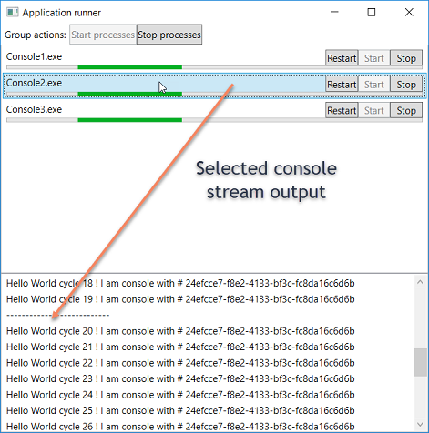

# ProcessRunner

Simple, reliable and fast utility with User Interface for easier maintaining multiple console applications running simultaneously under the one window instead of process per window.
 
Utility listens to Win events for process start/stop and for this reason it needs to be run as Administrator (a bit annoying, I know).



## Does not require installation, just:
1. Build the solution
2. Run the build
3. App will generate Configuration.JSON file
4. Configure your processes
5. Restart ProcessRunner

## Configure process/console list like in example (step 4.)
```json
[
  { 
    "DisplayName": "MyTestingConsole",
    "ProcessFileName": "Console1.exe",
    "Arguments": "",
    "RootPath": "c:\\Console"
  },
  { 
    "ProcessName": "",
    "ProcessFileName": "Console2.exe",
    "Arguments": "",
    "RootPath": "c:\\Console"
  }
]
```

## Want to contribute with idea?
Please submit pull requests that are based on the develop branch. Sample work Your pull request will take "yourWork" branch in your repo and merge into our develop branch.
Where possible, pull requests should include unit tests that cover as many uses cases as possible (not always relevant). 

Code conventions are based on Resharper - if you dont have it, follow ones at VS.

Leave me [your feedback](https://www.martinstanik.com "My personal home page")  and enjoy the app!

"# Ariane" 
