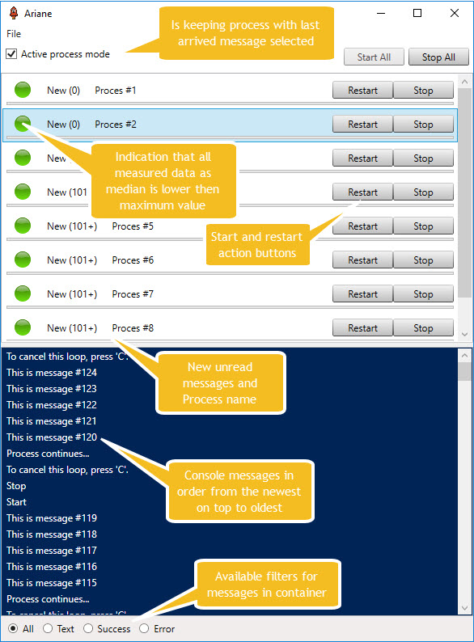
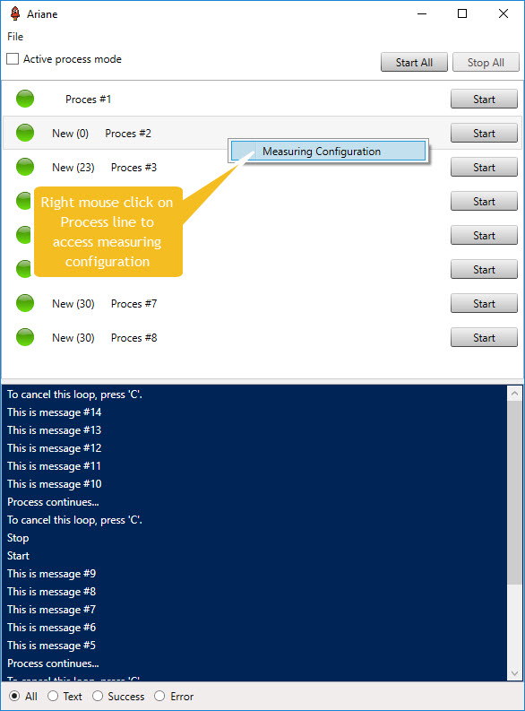
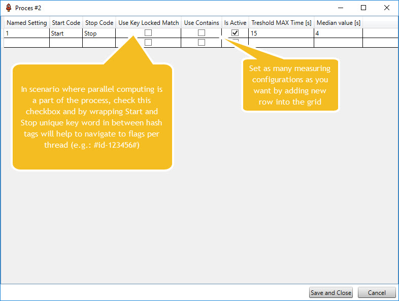
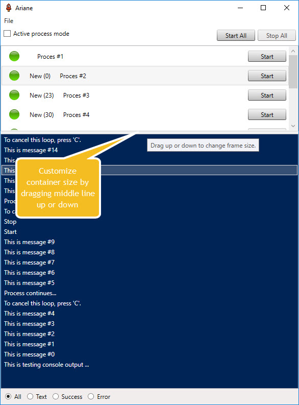
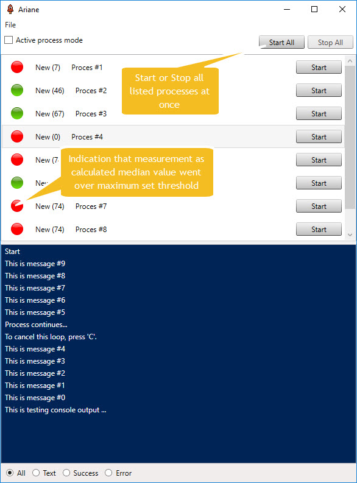

# Ariane

Easy to use utility for Windows process background processing orchestration monitoring. 
Standalone Windows application built on **WPF** with multiple consoles display capabilities and high level of customization with JSON file.

With this application, users can easily filter and copy text output messages from the console to any other application.

## Application UI overview


## What type of problems does it solve?
The application helps you to keep a track of the latest output console data coming from Windows background processes and navigate to Error type messages by using custom filters and copying selected text records from the output console out to another application for further data analysis.

The standalone application is built as one executable file, only. This helps users with application portability, **is insanely easy to install (just copy the file and run)**, and keeps all dependency libraries in one physical container.

A new integration extension with **RabbitMQ** Pub/Sub Saas/service helps to decouple the utility from the background services, hosted on one application server or on globally distributed virtual machines. For more details on how to configure the pipeline, navigate to the RabbitMQ section below. 

**(Prerequisite) The utility listens to Win events for process Start/Stop and needs to have an Administrator Windows access granted before start.**

## Quick guide on how to interact with the user interface













## Does not require installation, just:
1. Build the solution
2. Run the Ariane executable file for the first time and after it opens up, close it
3. **Configuration.JSON** file at the application root path will be generated
4. Open the file and configure your processes
5. Start Ariane

## Configure process/console list like in example (step 4.)
```json
[
  {
    "DisplayName": "Proces #1",
    "ProcessFileName": "TestingConsole.exe",
    "Arguments": null,
    "RootPath": "C:\\Users\\marti\\source\\GitHub\\Ariane\\output\\Debug",
    "LoggingSourceType": "Console",
    "RabbitMQTopicName": null,
    "MeasureSettings": [
      {
        "Name": "1",
        "StartCode": "Start",
        "StopCode": "Stop",
        "IsActive": true,
        "ThresholdMaxTimeInSec": 1,
        "UseContainsEvaluation": false,
        "UseKeyLockedMatch": false
      }
    ]
  },
  {
    "DisplayName": "Proces #2",
    "ProcessFileName": "TestingConsole.exe",
    "Arguments": null,
    "RootPath": "C:\\Users\\marti\\source\\GitHub\\Ariane\\output\\Debug",
    "LoggingSourceType": "Console",
    "RabbitMQTopicName": null,
    "MeasureSettings": [
      {
        "Name": "1",
        "StartCode": "Start",
        "StopCode": "Stop",
        "IsActive": true,
        "ThresholdMaxTimeInSec": 15,
        "UseContainsEvaluation": false,
        "UseKeyLockedMatch": false
      }
    ]
  }
]
```
## Application behaviour to be aware of
In very long running use cases and beside the fact that output messages are stored in memory only,
application will **keep 1100** console messages per process and will delete the oldest **100 every time number exceeds**.

## RabbitMQ pipeline configuration
1. Install RabbitMQ if not installed already [RabbitMQ for Windows](https://www.rabbitmq.com/install-windows.html)
2. Build NLog.RabbitMQ.Appender from the solution
3. Install NLog.RabbitMQ.Appender.dll appender from the output to application which will broadcast log messages. 
If using **nLog** use this getting started quick quid how to add the appender to your application:
```c#
  <nlog  xmlns="http://www.nlog-project.org/schemas/NLog.xsd"
      xmlns:xsi="http://www.w3.org/2001/XMLSchema-instance">
    <extensions>
      <add assembly="NLog.RabbitMQ.Appender"/>
    </extensions>
    <targets>
      <target name="rabbit" xsi:type="RabbitMQ" />
    </targets>
    <rules>
      <logger name="*" levels="Debug,Info" writeTo="rabbit" />
    </rules>
  </nlog>
```
4. Add **RabbitMQConnection** to appSettings of **app.config** file as in example below
```c#
  <appSettings>
    <add key="RabbitMQConnection" value="host=localhost;port=5672;virtualHost=/;username=admin;password=admin;requestedHeartbeat=0"/>
  </appSettings>
```
5. Change LoggingSourceType to **RabbitMQ** and what **RabbitMQTopicName** topic routing key you want to use as in example below
```json
[
  {
    "DisplayName": "Proces #1",
    "ProcessFileName": "TestingConsole.exe",
    "Arguments": null,
    "RootPath": "C:\\Users\\marti\\source\\GitHub\\Ariane\\output\\Debug",
    "LoggingSourceType": "RabbitMQ",
    "RabbitMQTopicName": "Ariane",
    "MeasureSettings": [
      {
        "Name": "1",
        "StartCode": "Start",
        "StopCode": "Stop",
        "IsActive": true,
        "ThresholdMaxTimeInSec": 1,
        "UseContainsEvaluation": false,
        "UseKeyLockedMatch": false
      }
    ]
  }
]
```
6. Save file and start Ariane
7. Click Connect button once your monitored application is running beside RabbitMQ Hub service
_For more information how to use it, navigate into **NLog.RabbitMQ.Appender.Test** project within the solution_

## Want to contribute with idea?
Please submit pull requests that are based on the develop branch. Sample work Your pull request will take "yourWork" branch in your repo and merge into our develop branch.
Where possible, pull requests should include unit tests that cover as many uses cases as possible (not always relevant). 

Code conventions are based on Resharper - if you dont have it, follow ones at VS.

Leave me [your feedback](https://www.martinstanik.com "My blog")  and enjoy the app!

## Authors

* **Stanik Martin** - *The thinker* - [Stenly311](https://github.com/stenly311)
